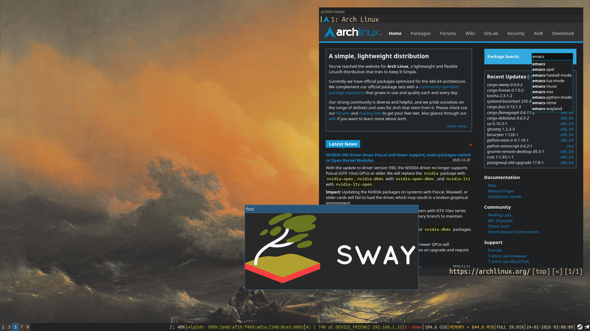
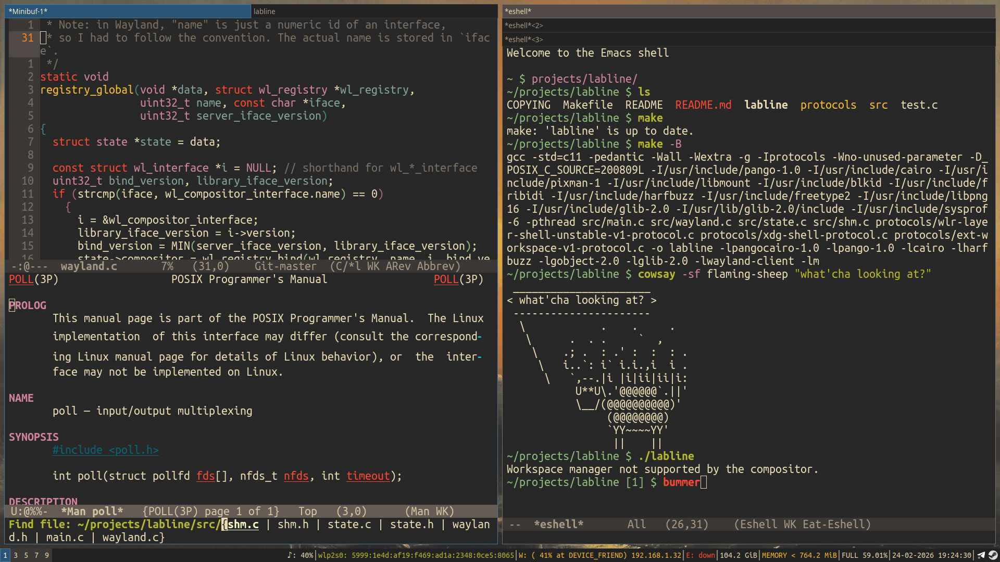

# .dotfiles
This setup was made for my laptop over a few months. I must admit that I grew very fond of Emacs, so if you’re familiar with its bindings, you’ll see the logic in using the same set of shortcuts across most of the programs. The recommended way to manage these files is with GNU Stow or plain old symlinks.

## Gallery
<p align="center">
    
    
</p>

*wallpaper: "The Ninth Wave" by I. K. Aivazovsky*</br>
*apps shown: emacs, qutebrowser, foot*

## Installation
Clone and cd into the repo, make sure that `.config`, `.local` and `.cache` exist in your `$HOME`, run `stow package-name` for every directory you want symlinked (or `stow */` to link every package at once), and tweak the dotfiles to your liking.
```zsh
$ git clone --depth 1 https://github.com/ryazh3nka/.dotfiles.git $HOME/.dotfiles
$ cd $HOME/.dotfiles
$ yay -S --needed - < PACKAGES.md
$ mkdir -p $HOME/{.config,.cache,.local/share,.local/bin}
$ stow package
```
The GTK3 theme is [Gruvbox](https://github.com/Fausto-Korpsvart/Gruvbox-GTK-Theme), and the icon pack is [Delft](https://github.com/madmaxms/iconpack-delft). Each package in this repo contains a separate readme (ignored by stow) with more thorough explanation of the install process.

## Uninstallation
Unstow every package with `stow --delete */` and optionally run `./clean.sh` to remove persistent data (I like my `$HOME` neat and tidy).
